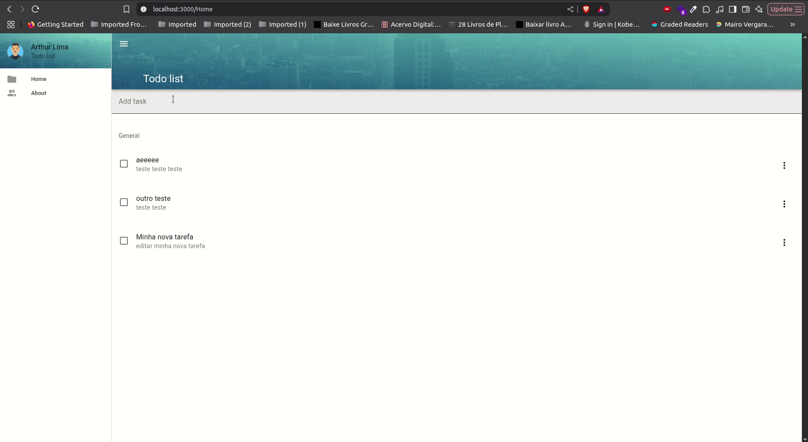

# 📝 Vue 3 + Vuetify To-Do List

Welcome to your beautiful and modern **To-Do List App** built with **Vue 3**, **Vuetify 3**, and **Pinia**!  
This project helps you stay organized, productive, and in control of your daily tasks — with style. 💅

---

<div align="center" >
  
</div>

## 🚀 Features

✨ **Modern UI** using Vuetify 3 components  
🖊️ Add, edit, and delete tasks  
✅ Mark tasks as completed  
📦 Task management with **Pinia** (centralized store)  
💾 Optional persistence via `localStorage`  
🎨 Responsive design for mobile and desktop  


---

## 🛠️ Tech Stack

- [Vue 3](https://vuejs.org/) ⚙️
- [Vuetify 3](https://next.vuetifyjs.com/) 🎨
- [Pinia](https://pinia.vuejs.org/) 🍍 for state management
- [Vite](https://vitejs.dev/) ⚡ (for fast development)
- [ESLint](https://eslint.org/) + [eslint-config-vuetify](https://github.com/vuetifyjs/eslint-config) for clean code ✅

---

## 📦 Installation

1. **Clone the repo**

```bash
git clone https://github.com/thurdelima/vue3-vuetify-todo-list.git
cd vue3-vuetify-todo-list
yarn 
yarn dev
```